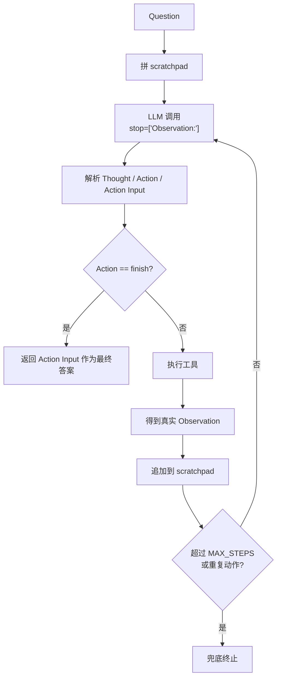

# 手写 ReAct Agent（不用框架）

一个**不依赖 LangChain / LangGraph 等任何 Agent 框架**、纯 OpenAI 兼容 API 手写的 ReAct Agent，完整实现 **Thought → Action → Observation** 循环。

配套对照实现见 [langchain-react-agent](https://github.com/Linjian5/langchain-react-agent)（同样的 ReAct，用 LangChain 重写），对比"手写 vs 框架"的代码量与控制粒度。

后端走 OpenAI 兼容协议，默认 [DeepSeek](https://platform.deepseek.com/)，改 `MODEL` + `OPENAI_BASE_URL` 即可切 OpenAI / Kimi。

## 为什么手写

理解 ReAct 论文（Yao et al. 2022）的最好方式是脱框架实现一遍。这个项目证明 ReAct 的本质只有约 130 行：一个带 `stop` 的 LLM 调用 + 正则解析 + 工具执行循环。

## 核心设计

| 关注点 | 实现 |
|---|---|
| **防 LLM 编造 Observation** | `stop=["Observation:"]` 让 LLM 输出到 Action 就停，由代码执行工具回填**真实** Observation |
| **终止条件** | 显式 `finish` 动作 + `MAX_STEPS` 兜底 + 连续重复动作检测，三重防死循环 |
| **错误回喂** | 工具抛 `ToolError` 不崩，把错误作为 Observation 喂回，LLM 自行决定重试/换工具 |
| **零依赖框架** | 只用 `openai` SDK，循环 / 解析 / 状态全部手写 |

## ReAct 循环流程



## 运行

```powershell
pip install -r requirements.txt
copy .env.example .env   # 填 DEEPSEEK_API_KEY
python agent.py
```

## 示例（多步推理）

```
You: 深圳和北京现在的温差是多少度？

--- Step 1 ---
Thought: 我需要先查深圳的气温
Action: get_temperature
Action Input: 深圳
Observation: 深圳 当前气温 29°C

--- Step 2 ---
Thought: 再查北京的气温
Action: get_temperature
Action Input: 北京
Observation: 北京 当前气温 18°C

--- Step 3 ---
Thought: 现在计算温差 29 - 18
Action: calculator
Action Input: 29 - 18
Observation: 11

--- Step 4 ---
Thought: 我已经知道答案了
Action: finish
Action Input: 深圳(29°C)和北京(18°C)的温差是 11°C。

✅ Final Answer: 深圳(29°C)和北京(18°C)的温差是 11°C。
```

## 项目结构

```
react-agent-from-scratch/
├── agent.py            # ReAct 循环核心（~130 行）
├── tools.py            # 3 个工具：calculator / get_temperature / wiki_search
├── requirements.txt
├── .env.example
├── .gitignore
└── README.md
```

## 面试讲解要点

- **ReAct 形式化定义**：扩展动作空间 Â = A ∪ L，L 是语言空间（thought），thought 不改变环境只更新上下文
- **为什么要 stop**：不加 stop，LLM 会一口气把 Observation 也编出来（幻觉），后续推理全建立在假数据上
- **手写 vs LangGraph**：手写理解原理；生产用 LangGraph 拿 checkpoint / HITL / 可视化 / trace（见配套仓库）

## 许可

MIT
